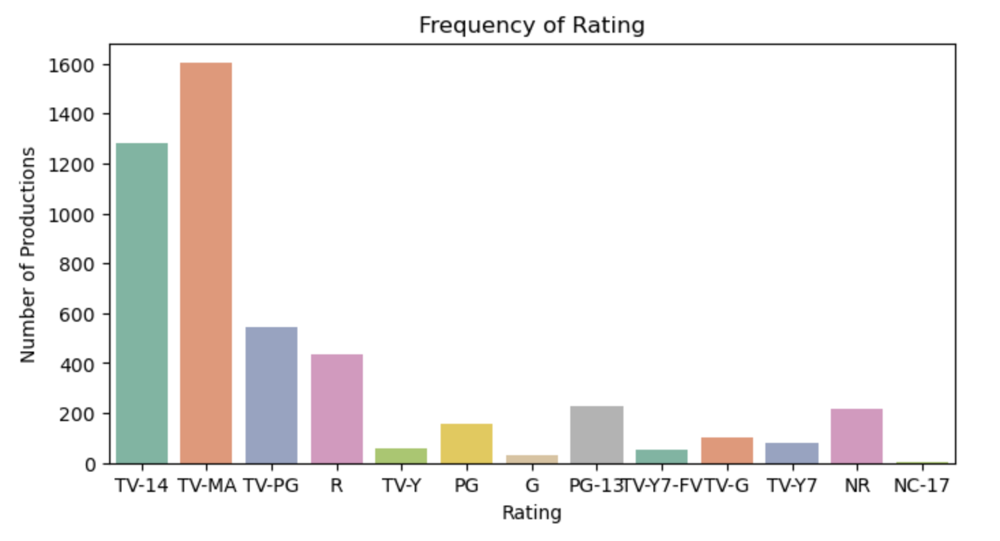
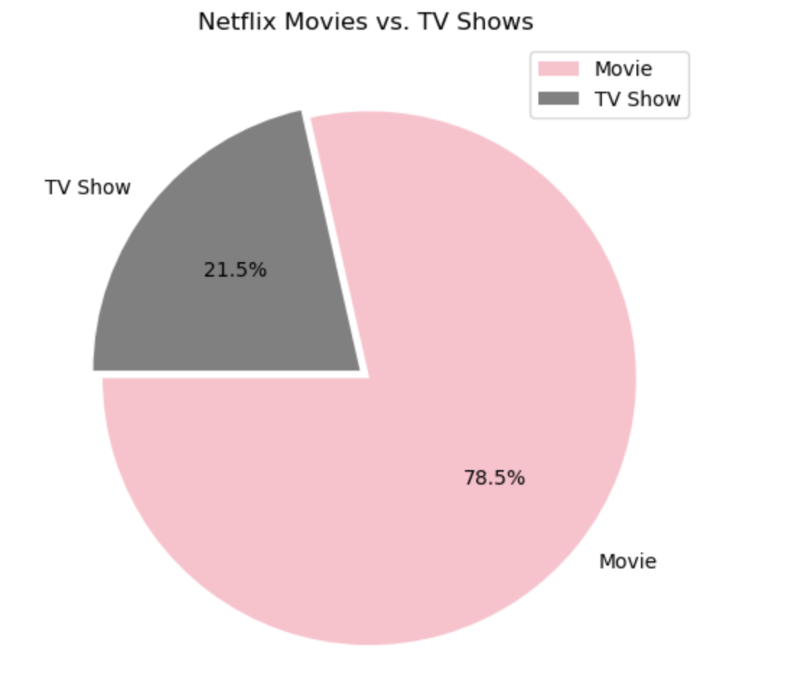
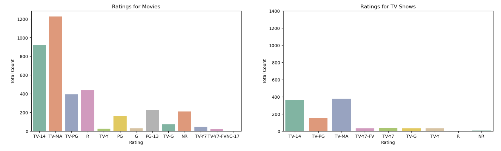
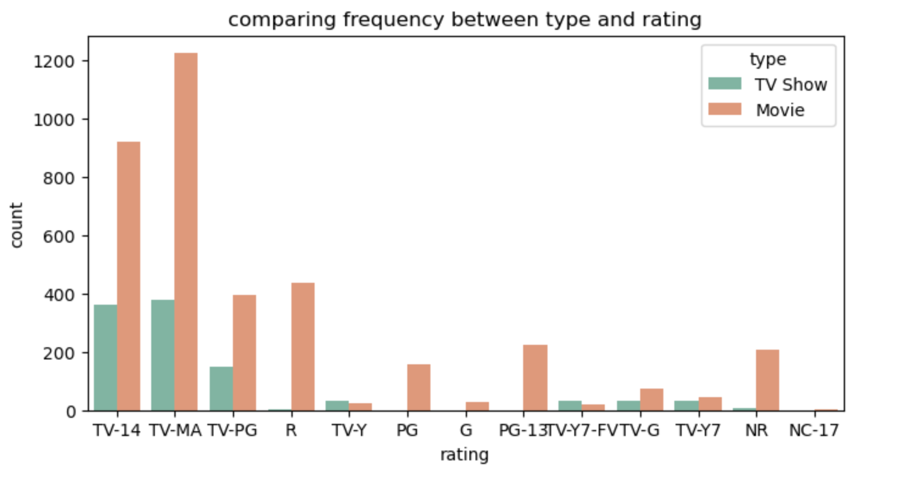
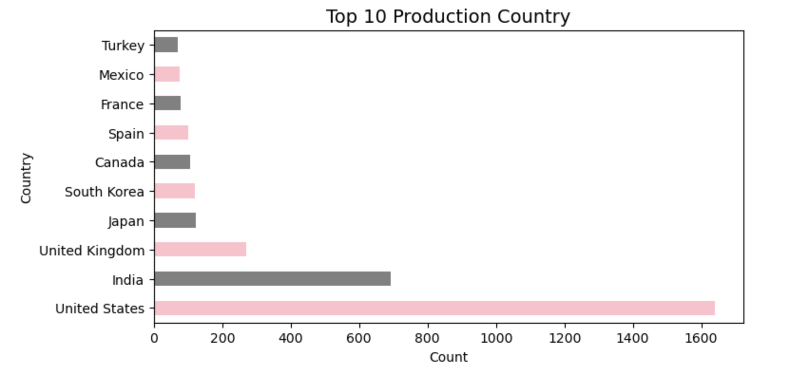
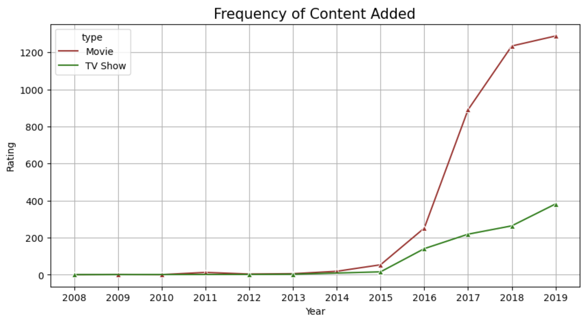

# IBM HR Analytics Employee Attrition and Performance.md
### Here is a link to the full project code and repository: <a href="https://github.com/yatongshi/TVX-Research/tree/main"> TVX </a>

_Main Directive: What Factors Influence Employee Attrition Rate at IBM?_
* xxx
* (add another line of description here) 
  
# Exploring Attrition Rate and Factors

## 1. What are the main ratings that are prevalent in Netflix?

   

In the distribution for rating, the top three are TV-14, TV-MA, and TV-PG. They are programs including materials that defined not suitable for children under 17, 14, or younger. The emphasis shows that Netflix has still put its main market on the adult content.

## 2. For further understanding, what about looking at ratings under the context of TV Show vs. Movie?

   

Netflix has three quarter of content concentrated on movie, while the rest of 24.2% belongs to TV show. Therefore, Netflix has much more focus on movies than shows.

   
   

By comparing rating type frequency with content type (movie vs. tv show) we see there is a similar trend still that Netflix puts more emphasis on adult content for their audience. However, there is a consistent choice where Netflix has put more effort in bringing movies in the platform. The only two exceptions here are for TV-Y7 and TV-Y7-FV. They are both programs for children age 7 and above. This could be Netflix aiming for a children's market that contains more TV shows for child education.

## 3. Which countries have the most productions?

      

From the data, we learn that the countries with the highest productions are United States, India, United Kingdom, Japan, and Korea, where the productions released in India is 50% number of United States. It shows that United States is still the primary market that Netflix targets at.

## 4. How many shows has Netflix added over the years?

      

The dataset shows years from 2008 to 2019. Netflix started rapidly take in movies since 2016, where they take around 600 movies in the single year of 2016 to 2017. While the show has a steady increase around 100 shows each year from 2014 to 2019.

### From this research I derived new key findings that can lead to xxx:

_These suggestions include:_
* xxx
* xxx
* xxx

  
