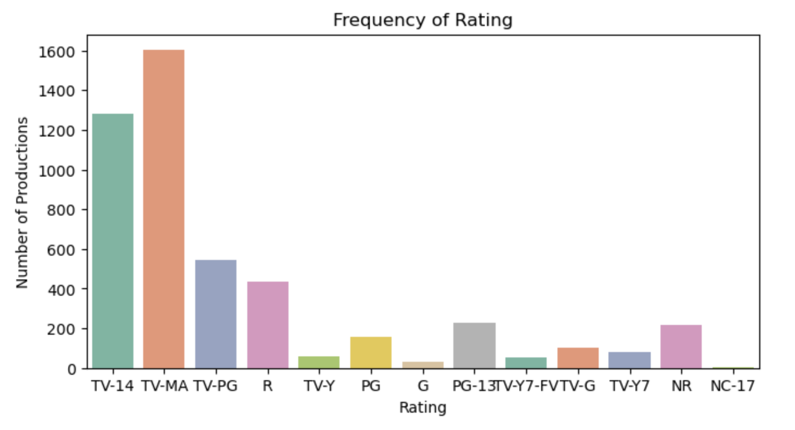
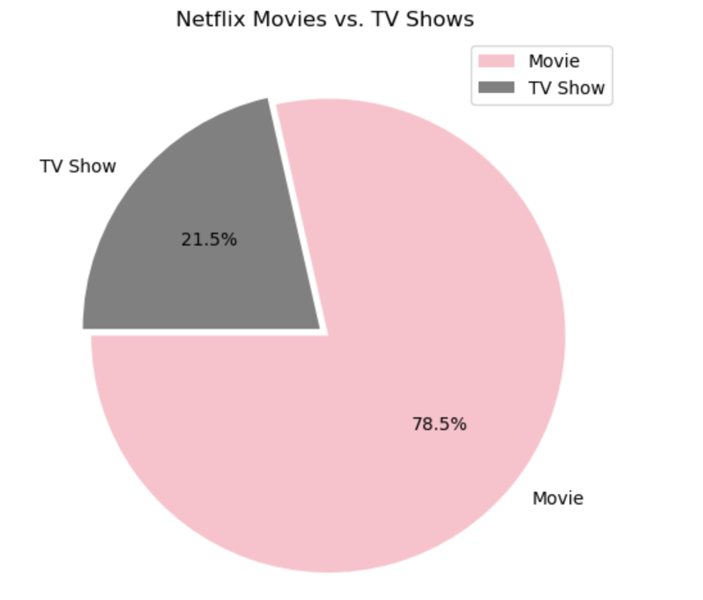
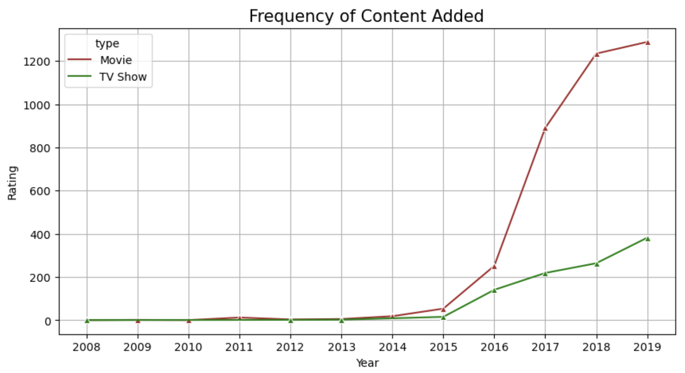

# IBM HR Analytics Employee Attrition and Prediction.md
### Here is a link to the full project code and repository: <a href="https://github.com/yatongshi/IBM-HR-Analytics-Employee-Attrition-and-Performance/tree/main"> IBM HR Analytics Employee Attrition and Prediction </a>

_Main Directive: What Factors Influence Employee Attrition Rate at IBM?_
* xxx
* (add another line of description here) 
  
# Exploring Attrition Rate and Factors

## 1. What is the Attrition Ratio?

   

The employee attrition ratio is 16.1% at IBM.
For the analysis, we are going to focus on environmental and company factors that could contribute to attribution.

## 2. What is the relationship between Job Role, Income, and Attrition Rate?

First, we will take a look at the relationship between Job Role and Attrition Rate.

 
 
The bar graph reveals that the manager roles such as research director, manager, and munufacturing director tends to have lower attrition rate compared to lower level positions.

## 3. Do Attrition Rate and Monthly Income Correlate at IBM?

To add another layer, we want to see if the attrition rate has to do with monthly income.

 

The overall picture of salaries affect attrition as much as the level of positions. The jobs that have the most attrition rate are the sales representatives and laboratory technician which are at the bottom of salary as well. However, research scientist, although has a similar range of income as laborary technician, has a much lower attrition rate which means the status of position also plays a role.

## 4. How Does Interpersonal Dissatisfaction Affect Attrition Rate?

Another reason that commonly causes attrition is interpersonal dissatisfaction. Let's examine here:

Does the years with current manager affect attrition?

      

From the graph above, we can tell there is a increse of attribution around the first year, the third year, and the eighth year. While attribution fluctuates in between, the rate generally goes does to almost zero after the eighth years. If the company wants to retain employees during long term, the HR team could initiate bonus programs and leadership appreciation program for the employees who are currently in the first, third, or eighth year with their managers.

To further understand, we will look at the specific breakdown of years with high attrition.
  1. The attributed employees that are first year with current Manager
     
    
    
    

The three graphs demonstrate a consistent trend that Laboratory Technician has a high attrition rate in general. At the same time, there is spike of attribution in sales executives and research scientist in their third year with the managers. For the future to lower attrition, IBM could provide check-in and incentives for sales executives and research scientists particularly at their third years. There seems to be a systematic reasoning with high attrition rate in the role of laboratory technician, which is worth investigating more.

## 5. Does Work-Life Balance Play a Role in Employees Attrition?

What is the relationship between overtime and attrition? 

    

ADD COMMENT

How does the amount of business travel affect attrition?

    

From the comparison, the data does not show much correlation between travel frequency and attrition. Later I can further investigate by calculating the percentage of attrition and comparing them again.

From the previous analysis, we conclude that the employees who are unable to balance work with life are the most frequent group leaving the company 

### From this research I derived new key findings that can lead to xxx:
Based on our previous analyses, we can say that the most important factors affecting employees attrition are:

  1. Monthly Salary: We found that employees with salaries of less than 5K are the most likely to leave their jobs
  2. Work Enviroment: Most of the employees leave their jobs when they are not comfortable in their work space.
  3. Overtime: When employees are stressed and put in overtime, more than 30% leave the company.
     
### What type of measures should the company take in order to retain their employees?
* We can increase the monthly salary a little or make bonuses.
* We can ask employees why they are not satisfied with the environment in which they work and try to fix this as much as possible.
* We make a schedule for employees to limit overtime, and if there is any employee who has a problem, we do not force him to work overtime.
 

  
