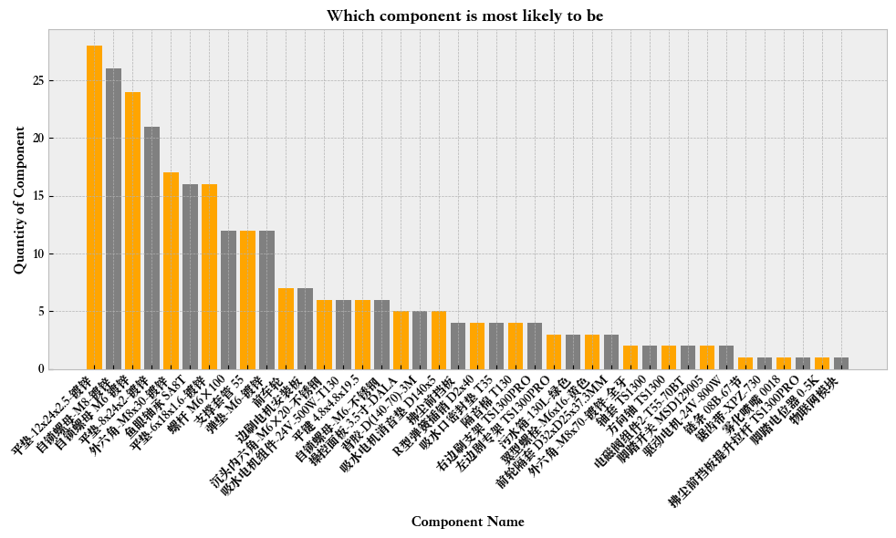

# Kaggle Exploratory for TVX Product Data
### Here is a link to the full project code and repository: <a href="https://github.com/yatongshi/Kaggle-Exploratory-for-TVX-product-data/tree/main"> Kaggle Exploratory for TVX Product Data </a>

_Main Directive: My goal is to look through the list of repaired components for TVX's cleaning machine and uncover and analyze the components that cost the most._

* Using xxx software to do xxx thing, i created xx analysis on xxx data.
* Utilizing these results, I ...xxxx.  

## 1. Which Components are Outliers Within the Context of Sum Price and Quantity?

    

Comment: we can see that there are 5 components that are way higher than the average sum price and 8 components that have broken more than 15 times.

## 2. Which Components Cost the Most Money?

  
 
Comment: From seeing the distribution of the top 20 components that have the highest sum cost, we can see that the top 5 components have the highest sum price that are much more than the rest of replaced components.
List: 驱动电机-24V-800W 1234.00前车轮4467.26 操控面板-3.5寸-DALA
3781.80污水箱-130L-绿色3271.29 吸水电机组件-24V-500W-T130 $3155.46

## 3. Which Components are More Likely to be Broken?

    
 

Comment: we can see that there is a distinct difference between the components that have been replaced more than 10 times where the unit might be more likely to break again in the future. (ask bee)

## 4. Is there a Seasonal or Monthly Pattern In the Broken Components Data?

  

Comment: It seems like the number fluctuates within the two monthes from October to December where there is a short spike around November 15th. It could be because of the quick temerature drop around first frost around the region. It's worth to investigave further once we obtained more data points over the month.

_In Summary:_
* one sentance
* two
* conclusion

