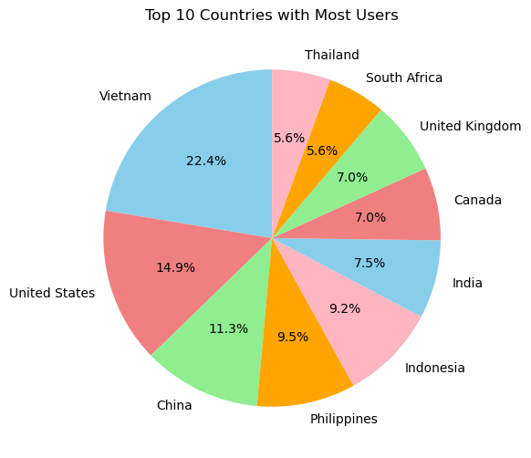
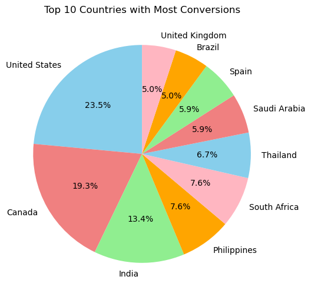
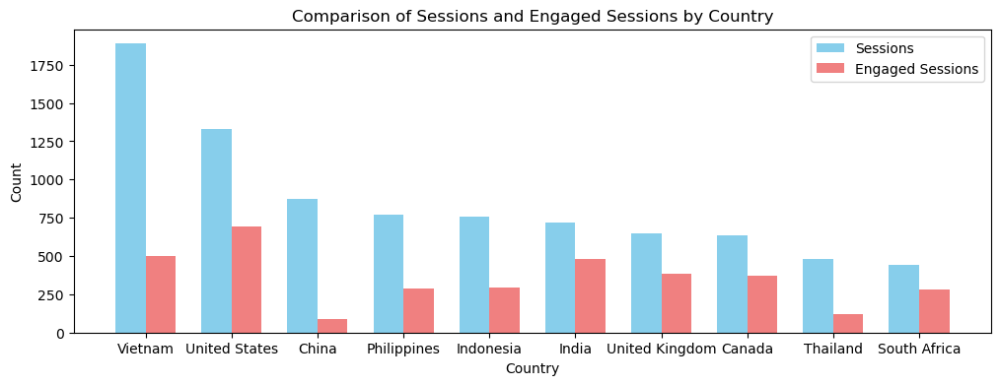
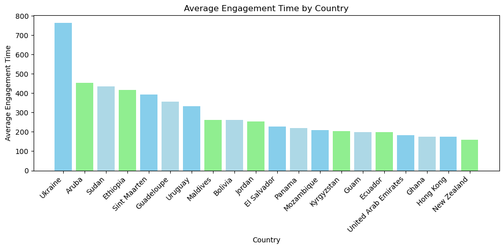
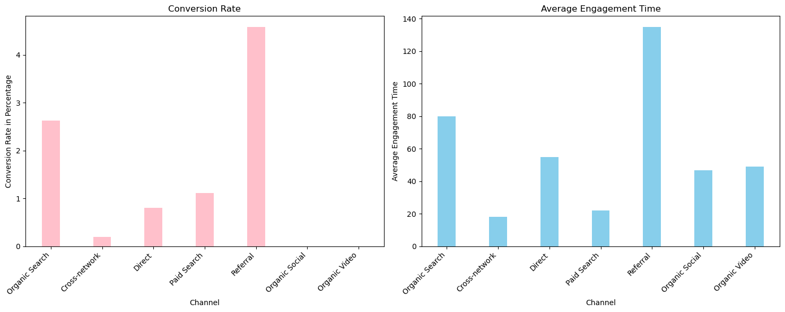
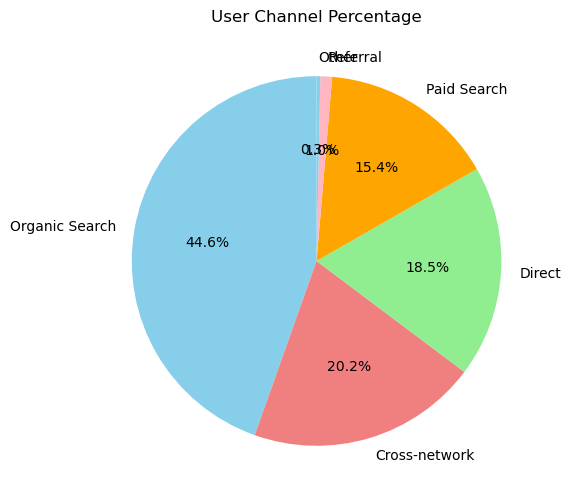

# TVX-Research
### Here is a link to the full project code and repository: <a href="https://github.com/yatongshi/TVX-Research/tree/main"> TVX </a>

_Main Question: how do we attract more people to try out TVX's cleaning products?_
* Using Google Analytics data, I examined users by country, engagement rate, time, and conversion to from visit to customer.  
  
### Results of Report
From this research I derived new key findings that can lead to higher engagement rate, return and revenue for the company.  

_These suggestions include:_
* Creating a Referral Program
* Targeting New Markets and Countries
* Implementing Website Translations
* Prioritizing Keyword Optimization for Organic Search

### Data Insights from the Report
Graph showing the top 10 countries with most users. This reveals that the top countries that obtain volume are Vietnam, the United States, China, Philippines, and Indonesia. Our potential market that natually attracts volume are in the South East Asia and North America regions.

 

Graph showing top 10 countries with the most conversions. Shows that the top countries that have the most conversions are United States, Canada, and India. The countries have the most conversion are mostly in North America which takes over the 42.8%, which also emphasizes that North America is big market that's worth putting future energy into.

 

Graphing a comparison of sessions and engaged sessions by country. The graph validates our assumption from previous data. The countries in English-Speaking countries seem to have a much higher engaged rate compared with other Non-English speaking countries. This could be very likely because the website is not tailored to the user experience in non-English speaking countries. One recommendation is that we can build a feature to auto-translate for the countries that we want to target at.

  

Graph revealing the average engagement time by country. When we measure the highest average engagement time, we can see that there are many countries that have not popped up previously but are interested in the products, including 5 Asia-Pacific countries, 4 African countries, and 3 South American countries. Those are also potential markets that we can target at in the future marketing plan.

 

Comparing a graph of the conversion rate and average engagement time. The trend shown in Conversion Rate is very similar to the trend in Average Engagement Time. The Referral and Organic Search provides the highest ranking for both index, which means that they are the most effective ways to convert a potential customer to a user. For the future, we can try to prioritizing on the two channels to obtain the most efficient results. 

 

Graphing the user channel percentage. Looking at the percentage of User Channel, Organic Search plays 44.6% out of all channels, which is a reasonal number. However, the referral rate only accounts for less than 1%. Our priority should be setting up a referral program from our existing customers to increase sales. 

 

Conclusion:
We are able to examine potential ways to attract new customers through Google Analytics data from 01/01/2023 to 12/13/2023. Here are some business suggestions to increase revenue in the future:

Create a Referral Program: establish a referral program leveraging the observation that the Referral channel accounts for less than 1% but has shown to be highly effective in both Conversion Rate and Average Engagement Time. Encourage existing customers to refer others, focusing on building a network of satisfied customers who can contribute to increased sales.

Target New Markets and Countries: identify and target new markets based on the observation that there are countries with high engagement and interest in the products. Expand marketing efforts to these untapped regions, tailoring strategies to meet the specific needs and preferences of each market. I included the countries that show the overall greatest interest in the following list 1.

Implement Website Translations: address the discrepancy between Users and Conversions in Vietnam and Indonesia by implementing website translations. Build a feature for auto-translation to enhance the user experience, especially in non-English speaking countries, where there is a notable difference in engagement rates. 

Prioritize Keyword Optimization for Organic Search: continue prioritizing keyword optimization for Organic Search: Organic Search plays a significant role, contributing 44.6% of all User Channels. Focus on SEO strategies to maintain and improve visibility, ensuring the company remains prominent in search engine results to drive organic traffic.

List 1:
North America: Mexico Canada United States
Europe: Italy Portugal Netherlands Germany Spain United Kingdom Russia Turkey (Türkiye)
Asia: Thailand Israel South Korea United Arab Emirates Philippines India Australia Singapore Malaysia Qatar Saudi Arabia
Africa: Nigeria South Africa Egypt
Oceania: New Zealand
South America: Brazil

